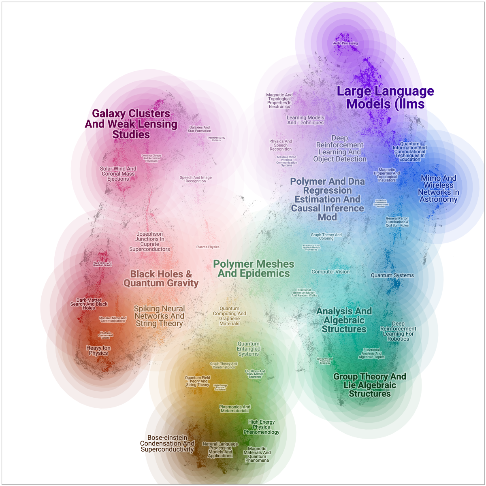

(Unclassified//OUO)
## Temporal/Fuzzy Mapper
### V.0.3.x - July 12 '24
-----------------------------------------------
This is a mostly-working version of the fuzzy mapper code for generating graphs & sankey diagrams of timestamped data. The algorithm is still evolving and I only made the repo public to easily share
it with a colleague, so use it at your own risk.

Direct questions to Kaleb D. Ruscitti; (kaleb.ruscitti@cse-cst.gc.ca before Aug 23 2024, or kaleb.ruscitti@uwaterloo.ca after that).

### Example:
#### ArXiV Papers 
~ 500,000 ArXiV titles and abstracts, UMAPped to 2D.

Using [DataMapPlot](https://github.com/tutteinstitute/datamapplot) and [TopicNaming](https://github.com/tutteinstitute/topicnaming) we can produce a static plot of our data:

Now, using this repository we can additionally analyse the temporal information. Using the Mapper algorithm with time as our 
lens function, we create a *temporal graph* of the topics (clusters) through time. The package includes two types of plots
to visualize this graph:

Centroid Plot             |  Temporal-Semantic Plot
:-------------------------:|:-------------------------:
  |  

### Components
There are three subcomponents
1. `temporal_grapher` - this is the original code which implements mapper' and builds the graph object.
2. `weighted fast_hdbscan` - HDBSCAN but the points are weighted; thanks Aaron Smith for writing this code :)
3. `modified holoviews` - A copy of holoviews with the Sankey diagram code mangled to work with mass creation & destruction.

### Conda Env
The environment.yml file contains a dump of my conda env when I tested this code. 
Stack overflow tells me that you can make a copy of the environment by running 
`conda env create -f environment.yml`
Worst case scenario you can just manually install all the usual packages. Just don't install holoviews or HDBSCAN to 
avoid collisions.

### Usage
The file `DemoV0.2.x.ipynb` is a start-to-finish example of how to generate a Sankey diagram with this package.

### Parameters
Since temporal grapher is mostly undocumented, let me quickly mention a few choices you can make. 

`HDBSCAN(min_cluster_size=n)`
This is the usual HDBSCAN parameter, but now that the points are weighted, and the weights are strictly <= 1, 
you generally want to set this a bit lower than you might usually do.

#### `tm.TemporalGraph()` parameters

##### Checkpoints
In mapper' there are no slices anymore. Slices have been replaced by checkpoints, which are single time points around
which you wish to cluster. You can either pass tm.TemporalGraph() a list of checkpoints;  `checkpoints = arrayLike`
or you can use the `N_checkpoints = int` and `slice_method = str` parameters to have it generate checkpoints for you.

`slice-method` takes either 'time' or 'data'. The time option generates checkpoints evenly spaced in time, and the data
option generates checkpoints evenly spaced in the number of data points.

#### Temporal kernel parameters 
The temporal kernel is used to give the points weight in time. You can pass a kernel function to tm.TemporalGraph
`kernel=myFunc`. The default is `temporal_mapper.weighted_clusters.gaussian` which is a Gaussian kernel. If your kernel
function takes parameters, you can pass `kernel_params = (param1, param2, ...)`

If you want to recover original mapper, you can pass `kernel = temporal_mapper.weighted_clusters.square`. This has a 
required parameter `kernel_params=(overlap,)` which is the amount of overlap between slices. If in doubt, set it = 1.

The parameter `rate_sensitivity` can be any number >=0, or -1. This controls how sensitive the temporal kernel is to 
changes in the temporal density of your data. This is an exponent factor; at the default setting (= 1.) points
with double the temporal density will have a kernel that is half as wide. At sensitivity 2, double density gives 1/4 as 
wide, and so on. The option -1 sets the scale to be logarithmic; 10x as dense = 1/2 as wide.

### A note on the Holoviews code
I'm not sure why, but sometimes when you try to plot the Sankey diagram it throws an error `No plotting class for Sankey found`, I can't consistently reproduce this error. If this happens, one solution is to reload the kernel and run the code again top-down.
